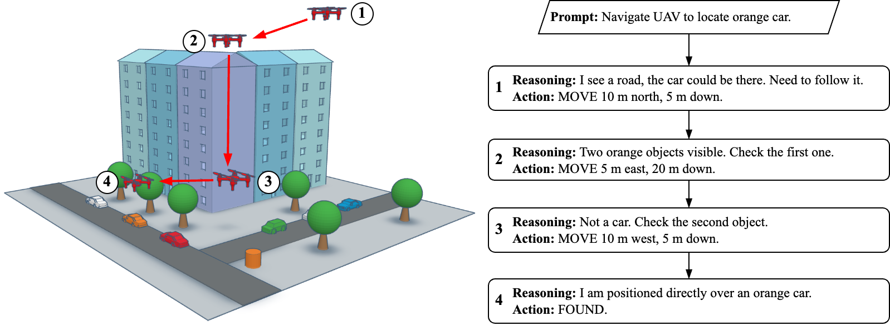
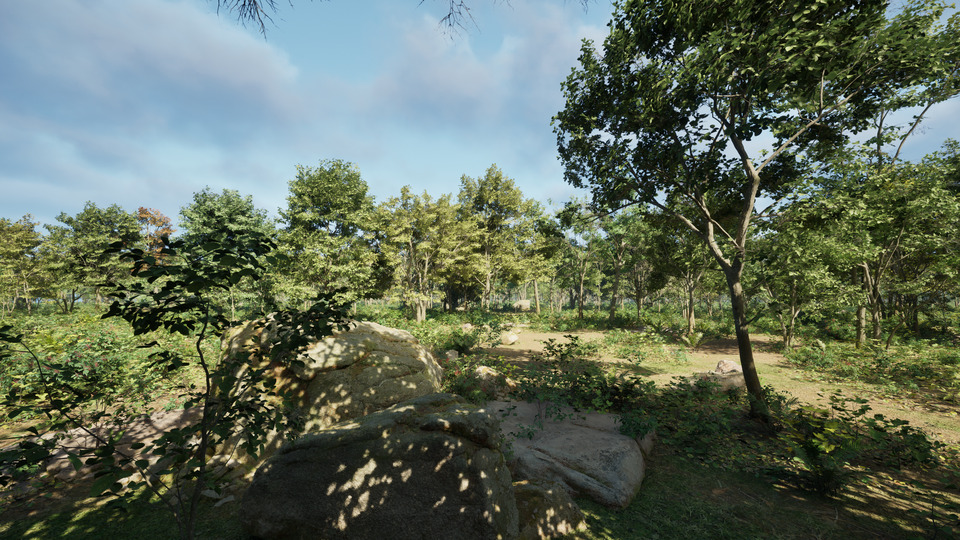
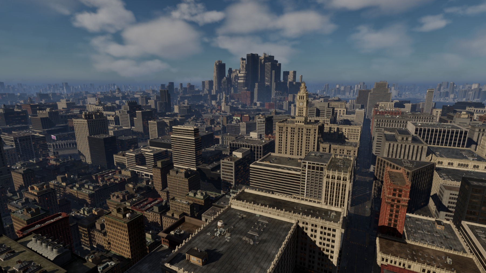
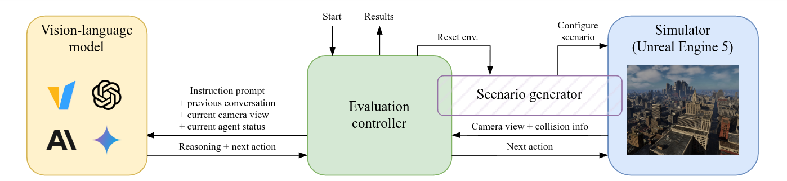
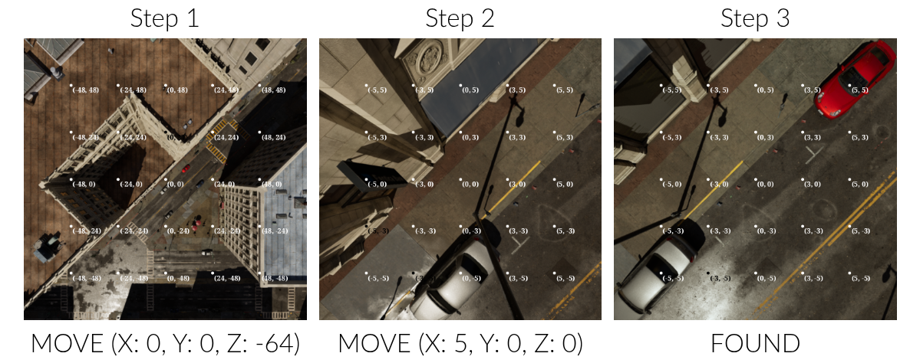

<div style="text-align: center; margin-bottom: 3em;" markdown>
{width="50%"}
<h1 style="margin-bottom: 0.1em !important;">FlySearch: Exploring how vision-language models explore</h1>

Adam Pardyl, Dominik Matuszek, Mateusz Przebieracz, Marek Cygan, Bartosz Zieliński, Maciej Wołczyk

[:material-attachment: Paper](https://arxiv.org/pdf/2506.02896){ .md-button .md-button--primary }  [:material-github: Code](https://github.com/gmum/FlySearch){ .md-button }
</div>


!!! abstract "Tl;dr"
    A benchmark for evaluating vision-language models in simulated 3D, outdoor, photorealistic environments. Easy for humans, hard for state-of-the-art VLMs / MLLMs.

## Leaderboard

<!--- do not ident - will break markdown hacks --->
<div style="text-align: center" markdown="1">
<div class="md-typeset__table" markdown="1">
<style>
th[colspan="2"] {
    text-align: center !important;
}
</style>
<table markdown="1">
<thead>
<tr>
<th>Model</th>
<th colspan="2">FS-1</th>
<th>FS-Anomaly-1</th>
<th>FS-2</th>
</tr>
<tr>
<th></th>
<th>Forest (%)</th>
<th>City (%)</th>
<th>Overall (%)</th>
<th>City (%)</th>
</tr>
</thead>
<tbody markdown="1">
<tr markdown="1">
<td markdown="1">:material-human: <i>Human (untrained)</i></td>
<td>--</td>
<td>66.7 &plusmn; 4.5</td>
<td>--</td>
<td>60.8 &plusmn; 6.9</td>
</tr>

<tr markdown="1">
<td markdown="1">:material-robot: Gemini 2.0 flash</td>
<td>42.5 &plusmn; 3.5</td>
<td><strong>41.5 &plusmn; 3.5</strong></td>
<td><strong>35.5 &plusmn; 3.4</strong></td>
<td>6.0 &plusmn; 1.1</td>
</tr>
<tr markdown="1">
<td markdown="1">:material-robot: Claude 3.5 Sonnet</td>
<td><strong>52.0 &plusmn; 3.5</strong></td>
<td>30.5 &plusmn; 3.3</td>
<td>27.5 &plusmn; 3.2</td>
<td><strong>6.5 &plusmn; 1.2</strong></td>
</tr>
<tr markdown="1">
<td markdown="1">:material-robot: GPT-4o</td>
<td>45.5 &plusmn; 3.5</td>
<td>33.5 &plusmn; 3.3</td>
<td>27.0 &plusmn; 3.1</td>
<td>3.5 &plusmn; 0.9</td>
</tr>

<tr markdown="1">
<td markdown="1">:material-robot: Pixtral-Large</td>
<td>38.0 &plusmn; 3.4</td>
<td>21.5 &plusmn; 2.9</td>
<td>15.0 &plusmn; 2.5</td>
<td>3.0 &plusmn; 0.8</td>
</tr>


<tr markdown="1">
<td markdown="1">:material-robot: Qwen2-VL 72B</td>
<td>16.5 &plusmn; 2.6</td>
<td>18.0 &plusmn; 2.7</td>
<td>7.5 &plusmn; 1.9</td>
<td>--</td>
</tr>
<tr markdown="1">
<td markdown="1">:material-robot: Llava-Onevision 72b</td>
<td>12.5 &plusmn; 2.3</td>
<td>6.5 &plusmn; 1.7</td>
<td>8.5 &plusmn; 2.0</td>
<td>--</td>
</tr>

<tr markdown="1">
<td markdown="1">:material-robot: Qwen2.5-VL 7B</td>
<td>6.0 &plusmn; 1.7</td>
<td>1.5 &plusmn; 0.9</td>
<td>2.8 &plusmn; 1.2</td>
<td>0.0 &plusmn; 0.0</td>
</tr>
<tr markdown="1">
<td markdown="1">:material-robot: InternVL-2.5 8B MPO</td>
<td>2.5 &plusmn; 1.1</td>
<td>1.5 &plusmn; 0.9</td>
<td>3.5 &plusmn; 1.3</td>
<td>--</td>
</tr>
<tr markdown="1">
<td markdown="1">:material-robot: Llava-Interleave-7b</td>
<td>0.0 &plusmn; 0.0</td>
<td>1.5 &plusmn; 0.9</td>
<td>0.0 &plusmn; 0.0</td>
<td>--</td>
</tr>
<tr markdown="1">
<td markdown="1">:material-robot: Phi 3.5 vision</td>
<td>0.0 &plusmn; 0.0</td>
<td>0.0 &plusmn; 0.0</td>
<td>0.0 &plusmn; 0.0</td>
<td>--</td>
</tr>
</tbody>
</table>
</div>
</div>

## Motivation: Vision-Language Models for Embodied AI exploration

Can Vision-Language Models (VLMs) perform active, goal-driven exploration of real-world environments?

* **The real world is messy and unstructured.** Uncovering critical information and decision-making requires
  curiosity, adaptability, and a goal-oriented mindset.
* **VLMs offer great zero-shot performance** in many difficult tasks ranging from image captioning to robotics.
* The ability of VLMs to operate in realistic, open-ended environments **remains largely untested**.

## Idea: Evaluate VLM exploration skills in 3D open world scenarios

**FlySearch** -- a new benchmark that evaluates exploration skills using vision-language reasoning.

* **Task:** locate an object specified in natural language or by visual examples.
* **Embodied interaction:** control an Unmanned Aerial Vehicle (UAV), observing images obtained from successive
  locations of the UAV and providing text commands that describe the next move.

<div style="text-align: center" markdown>
{width="75%"}
</div>

## Realistic vision-language exploration benchmark

* **High-fidelity outdoor environment** built with Unreal Engine 5, enabling realistic and scalable evaluation of
  embodied agents in complex, unstructured settings.
* **A suite of object-based exploration challenges** designed to isolate and measure the
  exploration capabilities of VLMs and humans in open-world scenarios.
* **Procedurally generated.** We can generate an infinite number of vastly diferent test scenarios.
* **Easy to solve for a human, while challenging for popular VLMs.** We identify consistent failure
  modes across vision, grounding, and reasoning.

Our benchmark consists of two types of evaluation environments, forest
and city. For each environment, we can generate an infinite number of procedurally generated test
scenarios.

<div class="grid cards" markdown>
- :material-forest: __Forest environment__

    ---
    {width="80%"}

- :material-city: __City environment__

    ---
  {width="80%"}

</div>

## Standardized evaluation set

We define three levels of difficulty of FlySearch and provide a test set of generated scenarios:

* **FS-1:** The target is visible from the starting position, but can be just a few pixels wide in the initial view. The
  object is described by text (e.g. "a red sport car").
* **FS-Anomaly-1:** The target object is an easy-to-spot anomaly (e.g. a flying saucer/UFO). The object description is
  _not_ given to the model, the task is to look for an anomaly. Other settings as in FS-1.
* **FS-2:** The object can be hidden behind buildings or be far away from the staring position. Additional visual
  preview of the object is given to the model at the start.

## Evalutaion pipeline

FlySearch consists of three parts besides the vision-language model: the simulator, the evaluation controller, and the
scenario generator.

<div style="text-align: center" markdown>
{width="90%"}
</div>

## Benchmark environment details

* **Initial prompt:** Describes the target, provides information on how to perform actions, and the success conditions.
* **Observations:** During exploration, the model is provided with the current camera view of the UAV
  (500 × 500 px RGB image, downward-facing camera) and current altitude.
* **Action:** Relative movement coordinates or the _FOUND_ action (as text), preceded by an unlimited number of
  reasoning tokens.
* **Success condition:** The agent has the target's center in its view, is at most 10 meters above it, and responds with
  _FOUND_.

## Example trajectory

<div style="text-align: center" markdown>
{width="75%"}
</div>

Example of a successful trajectory in FS-1 performed by GPT-4o. The agent navigates to red sports car
object by first descending and then moving to the right. The first row shows the model’s visual inputs,
and the second actions it has taken. Note the presence of the grid overlay on images.

## Acknowledgements

<div style="text-align: justify; font-size: small">
This paper has been supported by the Horizon Europe Programme (HORIZONCL4-2022-HUMAN-02) under the project "ELIAS: European Lighthouse of AI for Sustainability", GA no. 101120237. This research was funded by National Science Centre, Poland (grant no. 2023/50/E/ST6/00469 and Sonata Bis grant no 2024/54/E/ST6/00388).
The research was supported by a grant from the Faculty of Mathematics and Computer Science under the
Strategic Programme Excellence Initiative at Jagiellonian University. We gratefully acknowledge Polish high-performance computing infrastructure PLGrid (HPC Center: ACK Cyfronet AGH) for providing computer facilities and support within computational grant no. PLG/2024/017483. Some experiments were performed on servers purchased with funds from the Priority Research Area (Artificial Intelligence Computing Center Core Facility) under the Strategic Programme Excellence Initiative at Jagiellonian University.
</div>

## Citation

```
@misc{pardyl2025flysearch,
  title={FlySearch: Exploring how vision-language models explore},
  author={Adam Pardyl and Dominik Matuszek and Mateusz Przebieracz and Marek Cygan and Bartosz Zieliński and Maciej Wołczyk},
  year={2025},
  eprint={2506.02896},
  archivePrefix={arXiv},
  primaryClass={cs.CV},
  url={https://arxiv.org/abs/2506.02896}, 
}
```

## Contact

For questions, please open an issue on GitHub or contact Adam Pardyl -- adam.pardyl &lt;at&gt; doctoral.uj.edu.pl.

<div style="display: flex; flex-direction: row; flex-wrap: wrap; justify-content: space-between">
<a href="https://ideas-ncbr.pl/en/" rel="noreferrer" target="_blank"></a>
<a href="https://en.uj.edu.pl/en/" rel="noreferrer" target="_blank"></a>
<a href="https://gmum.net/" rel="noreferrer" target="_blank"></a>
<a href="https://en.uw.edu.pl/" rel="noreferrer" target="_blank"></a>
<a href="https://nomagic.ai/" rel="noreferrer" target="_blank"></a>
</div>

<div style="text-align: center; margin: 2em 0" markdown>
[:material-attachment: Paper](https://arxiv.org/pdf/2506.02896){ .md-button } [:material-github: Code](https://github.com/gmum/FlySearch){ .md-button } [:material-rocket: Get started](getting_started/10_setup/){ .md-button .md-button--primary }
</div>